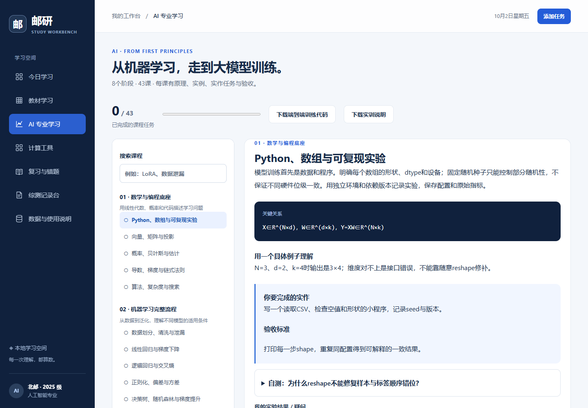

# Scholar Workbench · 邮研学习工作台

[English](README.md) · **简体中文** · [安全政策](SECURITY.zh-CN.md) · [隐私与数据流](docs/PRIVACY.md)

一个优先使用本地存储的学习工作台：PDF 教材学习、AI 专业课程与训练实训、综测活动及证明材料记录。前端使用原生 HTML、CSS、JavaScript，本机服务仅使用 Node.js 标准库。界面与自编课程目前为中文，中英文文档同时维护。

项目从大学 AI 学习场景出发，不代表任何高校的官方培养方案、成绩认定或综测规则，也没有高校背书。

## 功能与边界

| 模块 | 已实现 | 使用边界 |
| --- | --- | --- |
| PDF 教材 | 本地解析，目录识别，章节概念/步骤/对照/图表/自测，物理页码引用，Markdown 导出 | AI 生成需要自己的兼容 API 账户（DeepSeek 或学校接口）；扫描件需先 OCR；公式与排版须核对原文 |
| AI 专业学习 | 8 阶段、43 课：数学/Python、经典 ML、深度学习、Transformer、预训练、后训练、评估/RAG/部署、项目 | 自编学习路线，不能代替完整学历课程；部分工程主题为原理和作业 |
| 训练实训 | PyTorch 小型 Decoder：预训练、SFT、LoRA、DPO、统一评估、生成、预训练恢复 | 默认 CPU 教学规模；生产大模型、多卡与 CUDA 未验收 |
| 综测记录 | 活动、举办单位、奖级、日期、分类、贡献与真实文件/照片；检索、编辑、CSV | 记录证据，不自动计算或认定官方综测分值 |
| 日常工具 | 任务、专注、复习卡、卡诺图、电路、梯度下降、数字分类、分类指标 | 算法适用条件见 `docs/`；不推断个人经历 |
| 完整备份 | 原 PDF、文本、学习展示、课程笔记/进度、实际证明文件、基础记录 | JSON 包含真实文件字节，未加密；浏览器存储不能代替备份 |



## 本地启动

要求 **Node.js 18+** 和支持 ES modules、Web Workers、IndexedDB 的现代浏览器。建议使用仍受维护的 Node.js LTS；兼容下限不表示旧版本仍有安全维护。运行主应用无需安装 npm 依赖。

```sh
git clone https://github.com/yifanchen12/scholar-workbench.git
cd scholar-workbench
node server.js
```

打开 **http://127.0.0.1:5179**，保持服务运行。Windows 可双击 `启动工作台.cmd`。命令行入口可跨平台运行；本版本完整桌面验收在 Windows/Edge 完成。

端口冲突时设置 `STUDY_PORT`（1024–65535），例如 PowerShell：

```powershell
$env:STUDY_PORT = '5180'
node server.js
```

固定使用同一入口。`file:`、`localhost`、`127.0.0.1` 和不同端口属于不同浏览器来源，数据不共享。更换地址前导出完整备份。直接打开 HTML 不等价于本地服务模式。服务绑定 `127.0.0.1`，面向个人本机使用，没有公共网络服务或多用户认证。

## 上传教材与生成展示

1. 导入带文字层的 PDF，原文件与提取文字存入本机浏览器 IndexedDB。
2. 填写服务商或学校提供的 Base URL、API 密钥与模型名称。点击生成才调用，费用由该账户承担。
3. 生成目录会发送每页首 120、尾 60 个 JavaScript 字符的节选，不等同于完整审读全书。
4. 选择章节或物理页码生成展示。单次最多 40 页、100,000 个 JavaScript 字符；长章分段。
5. 对照 PDF 核查公式、例题、图表、答案；可展开提取文字、保存展示与导出 Markdown。

连接信息与密钥只在页面内存与请求中使用，刷新恢复默认，不写入持久存储或备份。选定文字、书名和学习目标经本机代理发送至 Base URL 指定的接口；默认是 [DeepSeek](https://api-docs.deepseek.com/api/create-chat-completion/)，也支持兼容的学校接口。目录发送节选，章节发送所选页全文；综测证明、课程笔记及其他记录不发送。第三方处理受其政策约束，发送前应确认教材使用权限。

密码 PDF 先解密，扫描 PDF 先 OCR。双栏顺序、数学符号、图片和公式可能提取不完整。引用页码从 PDF 第一页计数，不是印刷页码。结构与引用范围校验不能证明 AI 内容正确。无密钥时仍可本地阅读，不生成虚构结果。

Base URL 填写示例（学校域名为演示，请替换为学校提供的地址）：

| 输入 | 实际请求地址 |
| --- | --- |
| `https://api.deepseek.com` | `https://api.deepseek.com/chat/completions` |
| `https://ai.example.org/campus/v1/` | `https://ai.example.org/campus/v1/chat/completions` |
| `https://ai.example.org/v1/chat/completions` | 直接使用，不重复拼接 |

接口须兼容 Bearer 认证、非流式 Chat Completions、`response_format: {"type":"json_object"}` 和所需输出 token 预算。模型 ID 按学校提供填写，支持 `/`、`:`。需要校园网/VPN 时先连接。地址只能用 HTTP(S)，不得含账号密码、查询参数或片段。优先 HTTPS；HTTP 会明文发送密钥与教材文字，仅用于明确可信的本机/校园接口。不跟随重定向，请直接填写最终地址。接收数据与密钥的是所选服务，不一定是 DeepSeek。

若连接报错包含 `EACCES/EPERM`，说明本机策略禁止 Node.js 进程联网。停止该服务，在普通终端运行 `node server.js`，或允许该进程对外联网。这类失败发生在收到 API HTTP 响应之前，不能判断密钥或模型是否有效。未认证请求返回 `401` 只说明地址可达，不代表带真实密钥的生成已成功。

## AI 训练实训

基础 Python 实验使用标准库；小型语言模型要求 **Python 3.10+、PyTorch 2.2+**。建议使用独立虚拟环境，按 [PyTorch 官方安装页](https://pytorch.org/get-started/locally/) 选择适合操作系统的命令。

```sh
python practice/test_math_lab.py
python practice/run_lab.py
python tests/tiny_llm.test.py
python practice/tiny_llm.py all --steps 80 --output practice/llm-output
```

默认模型 2 层、64 维、4 头、上下文 64 token，共 **107,804 个基座参数**；LoRA 训练 **3,072 个参数**。自编颜色问答训练/验证/测试为 16/4/4 条。字符词表从训练侧拟合，未见字符映射 `<unk>` 并计数；无需下载外部基座或使用 API。

输出包括权重、日志、统一评估与 `training-report.json`，可导入训练记录工具。SFT 仅对回答计算 loss；LoRA 检查基座冻结；DPO 使用冻结的 SFT 参考模型。预训练支持恢复优化器与 CPU 随机状态。

示例来自真实 CPU 运行。**低 loss 不代表通用能力，DPO 偏好优化也不保证降低语言建模 loss，示例确实出现退化。** 生成固定数量 token，没有 EOS 停止机制，可能重复。CUDA、多卡、PPO、生产量化不属于已验收实现。详见 [训练说明](docs/AI专业学习与训练实训.md) 和 [模型卡](docs/MODEL_CARD.md)。

## 综测与备份

记录活动、单位、奖级、日期、个人贡献，上传真实文件/照片。照片可本地预览，其他文件可下载；不执行上传文档。CSV 只导出字段，完整备份才包含证明字节。未知信息留空，分值以当年官方认定为准。

限制：单个 PDF 50 MiB/1,000 页、最多 30 本；最多 1,000 项活动，每项 10 份证明、每份 20 MiB；总文件字节 120 MiB；导入完整备份上限 256 MiB。浏览器配额可能更小。

换设备、清理浏览器或大量编辑前导出完整备份。备份为明文 JSON，**Base64 不是加密**。导入前核查来源，替换前保存当前备份。隐私模式、清除站点数据、存储失败可能导致丢失；当前没有多窗口编辑冲突合并。旧经历与草稿兼容迁移，未知单位、奖级、日期不会被补造。

## 验证与开发

无需外部依赖：

```sh
node tests/core.test.js
node tests/cards.test.cjs
node tests/state-integrity.test.cjs
node tests/backup-size.test.cjs
node tests/digits.test.cjs
node tests/metrics.test.cjs
python practice/test_math_lab.py
python scripts/audit-public.py
```

另一个终端运行 `node server.js` 后：

```sh
node tests/server.test.cjs
node tests/textbook-api.test.cjs
```

API 检查使用模拟响应与占位密钥，不产生付费调用。浏览器检查可按需安装 Playwright（仅开发用途）：

```sh
npm install --no-save --package-lock=false playwright
npx playwright install chromium
node tests/workspace-v2.test.cjs
```

`PLAYWRIGHT_PATH` 指定 Playwright 包，`BROWSER_PATH` 指定 Chromium/Edge 程序，`STUDY_URL` 指定本机地址。端到端检查用隔离浏览器上下文、合成活动与附件，覆盖真实中文 PDF、课程进度、附件字节恢复、旧数据迁移和 24 个布局。历史 v1 UI 用例不作为新版验收入口，见 [验证范围](docs/VALIDATION.md)。

运行 `python scripts/package-workbench.py` 构建便携包，再用 `python scripts/verify-release.py` 校验新解压内容与独立实训。主 ZIP 为生成产物，不提交 Git；界面使用的小型 Python 实训包随源码提供。

## 目录与维护

```text
server.js / deepseek-api.js       本机服务与可配置 API 代理
textbook*.js / vendor/pdfjs/      教材解析、校验与展示
curriculum*.js / training*.js    自编课程、工具与实际 CPU 记录
records.js / vault.js             综测附件、持久存储与备份
practice/                        Python 与 PyTorch 实训
tests/ / scripts/                验证、打包与复现
docs/                            算法、隐私、模型卡、验证说明
```

贡献请阅读 [CONTRIBUTING.md](CONTRIBUTING.md)。漏洞按 [安全政策](SECURITY.zh-CN.md) 私下报告，不在公开 Issue 上传密钥、教材、证明或利用细节。

原创代码与自编内容采用 [MIT 许可](LICENSE)。PDF.js、字体组件、UCI 派生数字数据保留各自许可，**不被 MIT 重新授权**，见 [第三方声明](THIRD_PARTY_NOTICES.md)。用户导入文件与第三方服务不在本项目授权范围内。
